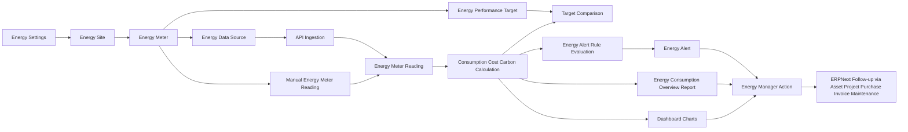

# Inovis EMS

Inovis EMS is a standalone Frappe custom app for energy monitoring, control, reporting, and ERPNext integration.

## Current Scope

The first implementation includes:

- EMS masters for sites, meters, settings, and performance targets
- Transaction capture for energy meter readings
- A script report with graphs for consumption, cost, carbon, and peak demand
- Workspace charts for monthly consumption and site-wise energy cost
- ERPNext integration touchpoints through native links to Company, Project, Cost Center, Warehouse, Purchase Invoice, and Asset
- Automated ingestion through `Energy Data Source` and `/api/method/inovis_ems.api.ingest_meter_readings`
- Alert automation through `Energy Alert Rule` and `Energy Alert`

## App Flow



Short version:

- Configure EMS masters and ERPNext links
- Capture readings manually or through API ingestion
- Auto-calculate consumption, cost, and emissions
- Compare against targets and evaluate alert rules
- Review alerts, dashboards, and reports
- Take action in ERPNext operations, maintenance, or finance

## Installation

```bash
cd /home/imetumba/benches/frappe15
bench --site sflsite install-app inovis_ems
bench --site sflsite migrate
bench build --app inovis_ems
```

## Showcase Data

Load a ready-made demo dataset with:

```bash
bench --site sflsite execute inovis_ems.demo.seed_showcase_data
```

This seeds:

- 3 demo energy sites
- 4 demo energy meters
- 2 demo data sources
- 2 performance targets
- 3 alert rules
- 60 days of readings per meter
- open alerts on the latest anomalous readings

## Functional Research

The research report and implementation roadmap live in:

- `docs/ems_requirements_report.md`

## License

mit
