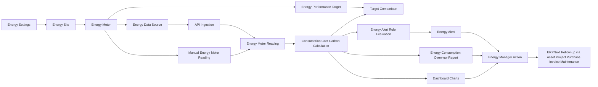

# Inovis EMS Requirements and ERPNext Integration Report

## 1. Research Summary

Energy Management Information Systems are used to monitor, analyze, and control energy use across buildings, campuses, factories, and distributed assets. The practical common ground across DOE and ISO guidance is:

- centralize and normalize meter and operational data
- measure energy performance continuously
- define baselines, targets, and corrective actions
- link people, process, and software into a continual-improvement loop

Reference sources:

- U.S. DOE FEMP: https://www.energy.gov/femp/what-are-energy-management-information-systems
- U.S. DOE FEMP capabilities: https://www.energy.gov/femp/energy-management-information-system-capabilities
- Better Buildings EMIS resources: https://betterbuildingssolutioncenter.energy.gov/energy-management-information-systems
- ISO 50001 overview: https://www.iso.org/iso-50001-energy-management.html

## 2. Basic EMS Requirements

These are the minimum requirements needed for a deployable EMS inside Frappe/ERPNext:

1. Organizational context
   Define company, sites, locations, owners, and reporting boundaries.
2. Meter registry
   Track all electricity, solar, diesel, gas, water, and utility meters with unit, multiplier, rate, and linked asset.
3. Reading capture
   Support manual entry, imported data, API/IoT feeds, and utility-bill-backed readings.
4. KPI reporting
   Provide energy consumption, cost, peak demand, carbon emissions, and power factor trends.
5. Baselines and targets
   Let teams define performance targets by company, site, or meter.
6. Exception visibility
   Highlight abnormal usage, cost spikes, and missing readings.
7. Workspace and dashboards
   Give operational users a dedicated EMS workspace with charts and quick actions.
8. Auditability
   Track who entered readings, when records changed, and what document supports a cost figure.

## 3. Advanced EMS Requirements

These are the next-phase capabilities for a more mature EMS rollout:

1. Automated acquisition from BMS, SCADA, Modbus, BACnet, MQTT, or utility APIs
2. Fault detection and diagnostics for abnormal equipment behavior
3. Demand-response workflows and peak-load curtailment planning
4. Energy intensity KPIs such as kWh per unit produced, per square meter, or per operating hour
5. Forecasting and anomaly detection using historical load, weather, and production data
6. Tariff modeling with time-of-use, demand charges, and fuel escalation
7. Maintenance integration that raises work orders or maintenance activities when energy drift is detected
8. ESG and sustainability outputs for carbon accounting and external reporting
9. Alerting and approvals for threshold breaches, outages, and target misses
10. Multi-entity rollups for campuses, plants, and group-level portfolio reporting

## 4. ERPNext Integration Model

The cleanest integration approach is to keep EMS as an independent app while linking to standard ERPNext records instead of modifying core ERPNext doctypes.

### Master data integration

- `Company`: reporting boundary and currency context
- `Project`: energy initiatives, solar deployments, retrofits, or efficiency programs
- `Cost Center`: energy allocation and cost rollups
- `Warehouse`: site-to-stock relationship for operational facilities
- `Asset`: tie meters to generators, transformers, HVAC systems, chillers, pumps, solar assets, or production equipment
- `Asset Location`: align sites with the ERPNext asset geography model

Relevant ERPNext references:

- Project: https://docs.frappe.io/erpnext/user/manual/en/project
- Asset: https://docs.frappe.io/erpnext/asset
- Asset Location: https://docs.frappe.io/erpnext/user/manual/en/asset-location
- Asset Maintenance: https://docs.frappe.io/erpnext/user/manual/en/asset-maintenance
- Maintenance Schedule: https://docs.frappe.io/erpnext/user/manual/en/maintenance-schedule
- Purchase Invoice: https://docs.frappe.io/erpnext/purchase-invoice

### Transaction integration

- `Purchase Invoice`: utility bills, fuel invoices, and third-party energy services
- `Asset Maintenance`: use energy exceptions to trigger maintenance or inspection
- `Maintenance Schedule`: build preventive checks for high-consumption or critical assets
- `Asset Movement`: preserve the site history of movable assets and portable meters

### Reporting integration

- EMS readings can feed energy cost by site, asset, or project
- energy spend can be compared with purchase invoices
- project-linked savings programs can be tracked against baseline and target periods
- assets with high energy drift can be routed into maintenance workflows

## 5. What Was Implemented in This First App Version

The first implementation is intentionally a strong foundation rather than an overextended phase-one build.

### Delivered doctypes

- `Energy Settings`
- `Energy Site`
- `Energy Meter`
- `Energy Meter Reading`
- `Energy Performance Target`
- `Energy Data Source`
- `Energy Alert Rule`
- `Energy Alert`

### Delivered analytics

- Script report: `Energy Consumption Overview`
- Dashboard chart: `Monthly Energy Consumption`
- Dashboard chart: `Energy Cost by Site`
- Workspace: `Inovis EMS`
- Automated alert evaluation on saved readings
- API ingestion endpoint for external systems

### Delivered role model

- `Energy Manager`
- `Energy Analyst`

## 6. Recommended Next Phase

1. Add ingestion pipelines for CSV, Excel, MQTT, Modbus, or REST APIs
2. Add tariff and billing doctypes for utility contract modeling
3. Add anomaly rules and notifications
4. Add site-level and asset-level energy intensity KPIs
5. Add work order or maintenance ticket generation on abnormal energy behavior
6. Add executive portfolio dashboards and ESG reporting outputs

## 7. Implementation Notes for Frappe

The workspace and dashboard implementation follows Frappe’s standard desk model:

- Workspace docs: https://docs.frappe.io/framework/user/en/desk/workspace

This keeps the EMS app upgrade-friendly and independent from ERPNext core code.

## 8. Flow Diagram

